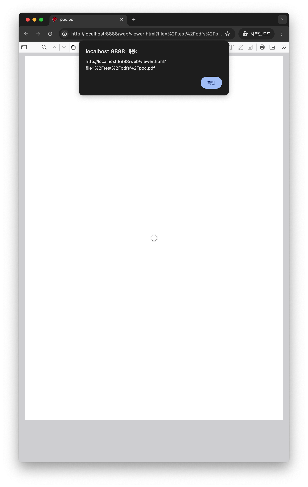

# CVE-2024-4367 & CVE-2024-34342: Arbitrary JavaScript execution in PDF.js

A type check was missing when handling fonts in PDF.js, which would allow arbitrary JavaScript execution in the PDF.js context. This vulnerability affects Firefox < 126, Firefox ESR < 115.11, and Thunderbird < 115.11.

If pdf.js is used to load a malicious PDF, and PDF.js is configured with isEvalSupported set to true (which is the default value), unrestricted attacker-controlled JavaScript will be executed in the context of the hosting domain.

- JS Execution
```
python3 CVE-2024-4367.py "alert(document.domain)"
```



- OS Command Execution (only Electron based)
```
python3 CVE-2024-4367.py "require('child_process').exec('open -a /Applications/Calculator.app');"
```


This is not my bug, I just made a PoC for it.

# Reference

- https://github.com/advisories/GHSA-wgrm-67xf-hhpq
- https://nvd.nist.gov/vuln/detail/CVE-2024-4367
